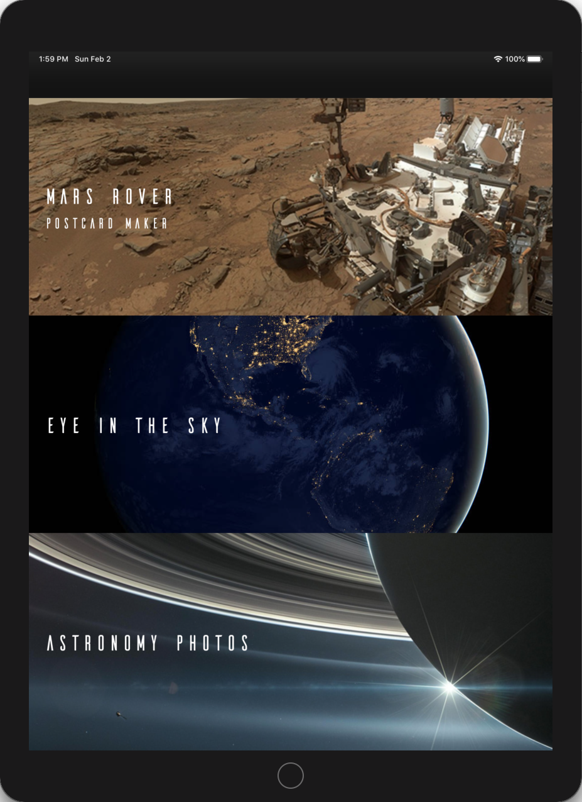
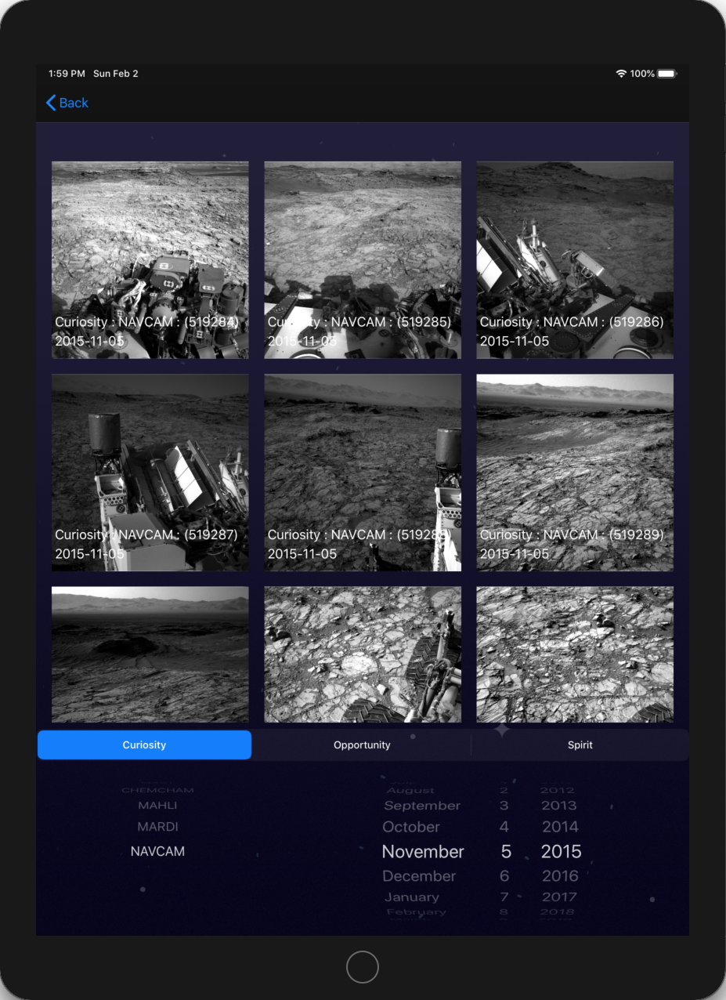
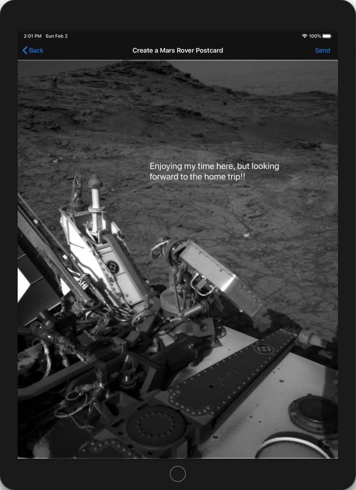
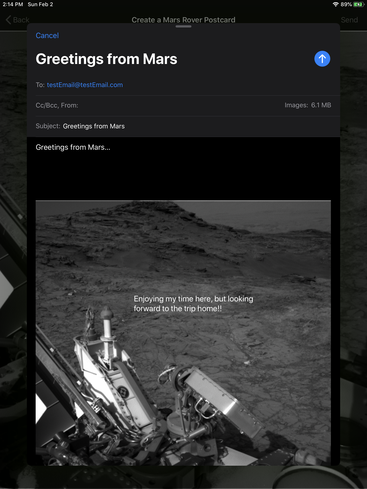
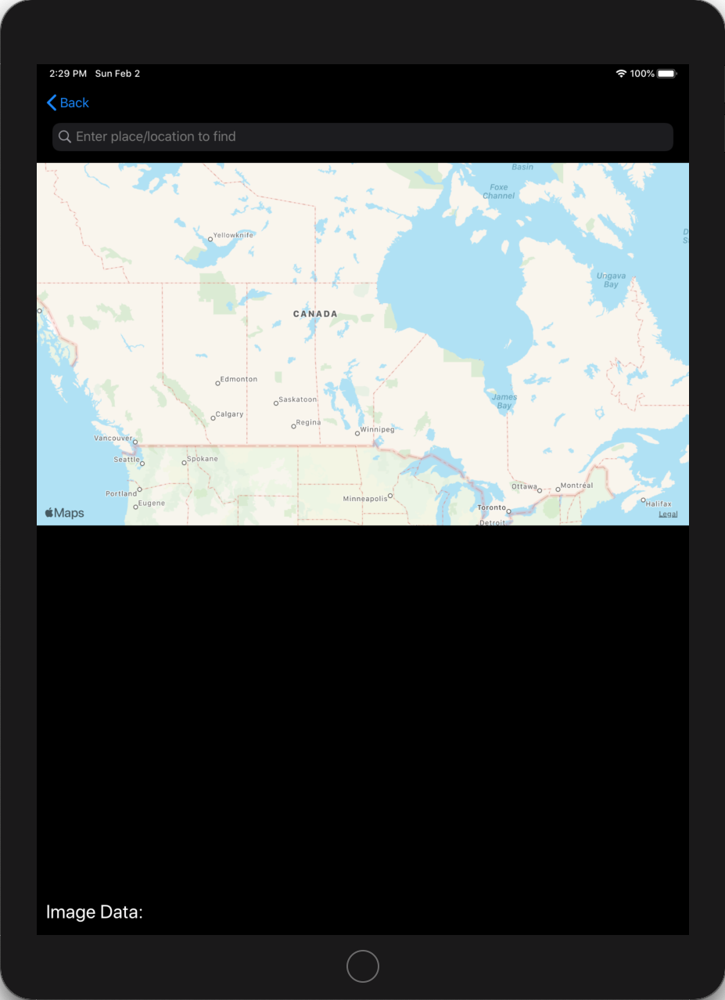
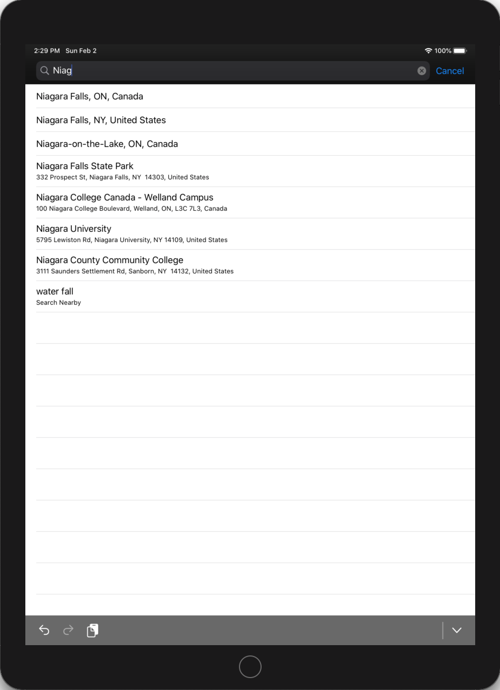
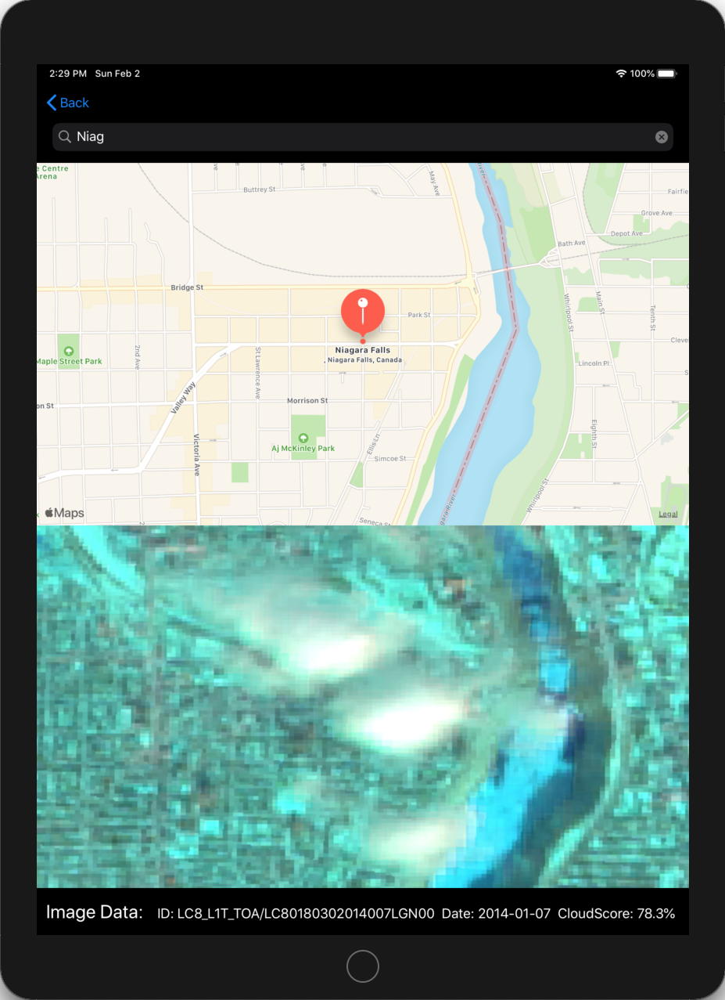
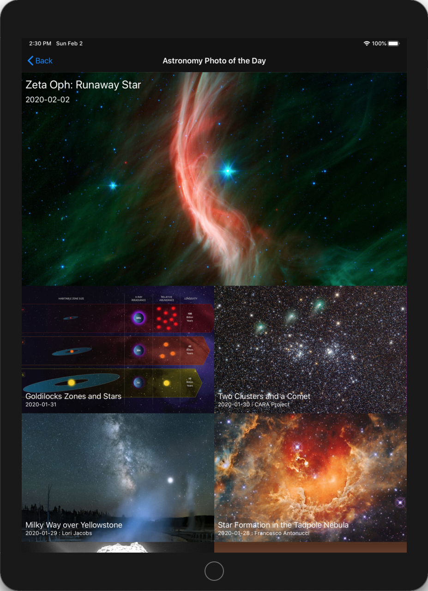

# Team Treehouse TechDegree Project 10

## NASA App

**App Description:**  NASA Imagery App.  Retrieve and display Mars Rover images for postcard generation, display a satellite image for a location selected by the user, display NASA image of the day.

**Swift Features Used:**
Unit Testing, Performance Testing (Xcode Instruments), Collection Views, Segmented Controls, Geolocation, Custom Fonts, Operation Queues, Result Type, Mail Compose View Controller, MK Local Search Completer. 

**Screenshots:**

